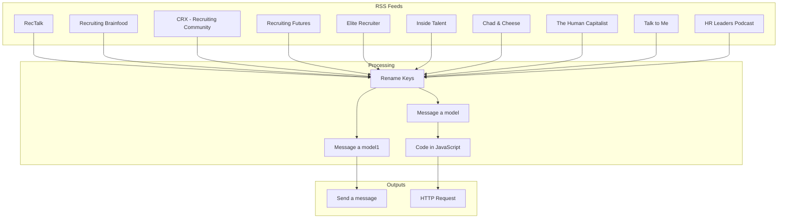

Based on the JSON file, here is a visual flow diagram of the n8n workflow:

**Explanation:**

*   The workflow starts with multiple RSS feeds (e.g., "RecTalk", "Recruiting Brainfood").
*   The data from all these feeds is consolidated and processed by the "Rename Keys" node.
*   From there, the data is sent to two parallel branches, each starting with a "Message a model" node.
*   One branch sends an email notification.
*   The other branch processes the data with custom Javascript code and then sends it to a webhook via an HTTP request.